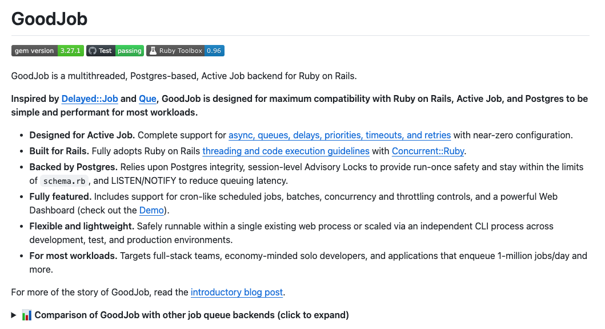
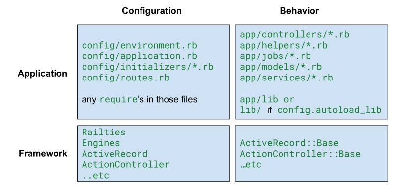
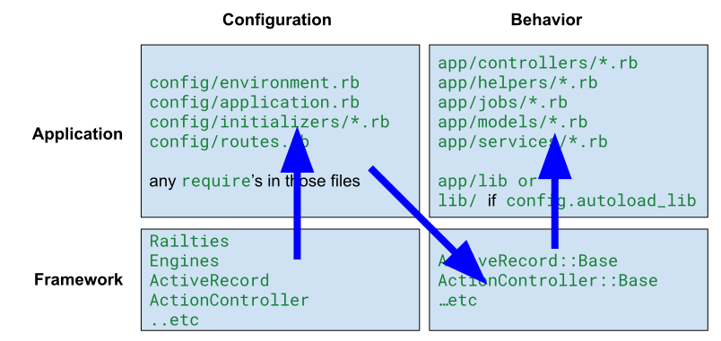
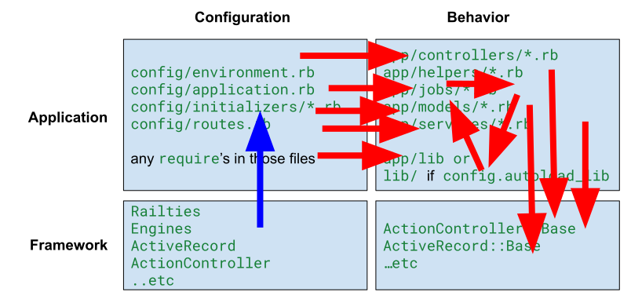
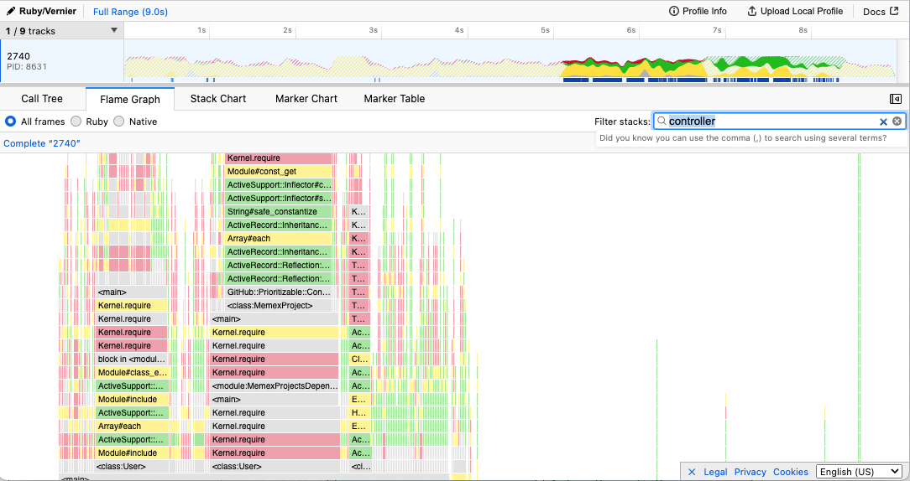
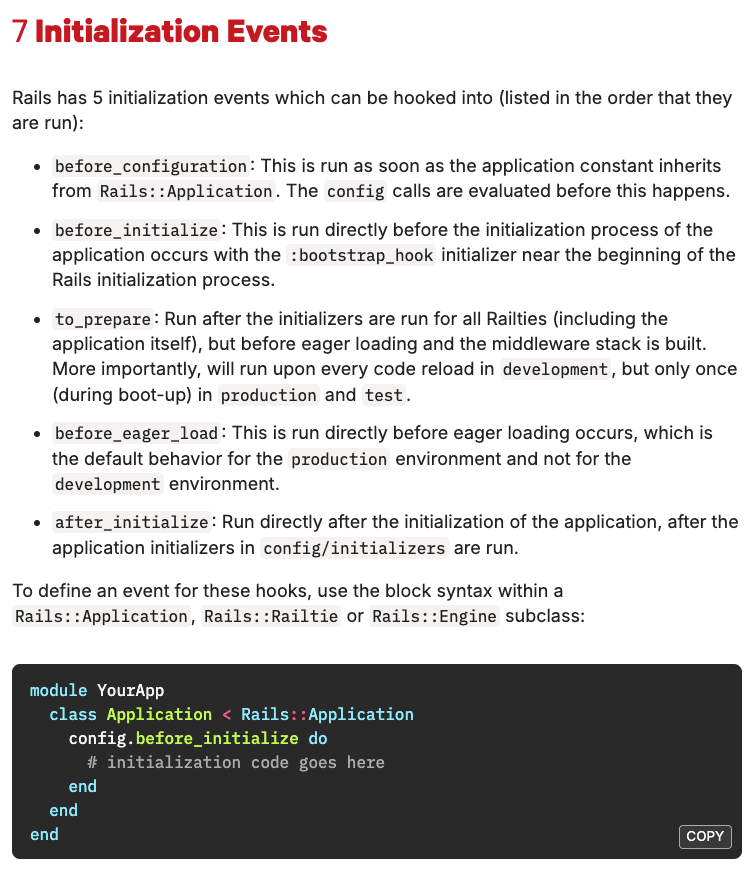
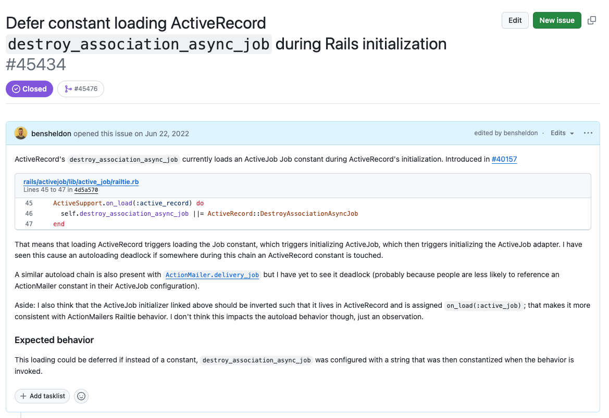

# An ok compromise: <br> Faster development by designing<br> for the Rails Autoloader<br> 

<br>

Find a copy of these slides at [`https://speakerdeck.com/bensheldon`](https://speakerdeck.com/bensheldon)

---

# My goal

Give some meaning and actions to this extra-dense documentation to help you make and keep your Rails development environment wicked fast.
<br>

- [Rails Guides: The Rails Initialization Process](https://guides.rubyonrails.org/initialization.html)
- [Rails Guides: Autoloading and Reloading Constants](https://guides.rubyonrails.org/autoloading_and_reloading_constants.html)
- [Rails Guides: Configuring Rails Applications: Initialization Events](https://guides.rubyonrails.org/configuring.html#initialization-events)
- [Rails API: `ActiveSupport::LazyLoadHooks`](https://edgeapi.rubyonrails.org/classes/ActiveSupport/LazyLoadHooks.html)


---

# About me, Ben Sheldon

💻 Work at GitHub. Engineering Manager of the Ruby Architecture Team

👍 Author of GoodJob, multithreaded Postgres-based Active Job backend 

🌆 Live in San Francisco


🐈‍⬛ 🐈‍⬛ Fostering 2 very good rescue cats that need a nice home

---



---

# A brief history of background jobs in Rails

- 2009 - **Delayed::Job**
- 2012 - **Sidekiq**
- 2013 - **Que**
- 2014 - **ActiveJob** in Rails v4.2
- 2020 - **GoodJob** ⬅️ That's my gem 🙌
- 2023 - **Solid Queue**

---

# Feature Request: Cron-style repeating/recurring jobs

> As a developer, I want GoodJob to enqueue Active Job jobs on a recurring basis so it can be used as a replacement for cron. Example interface:

```ruby
class MyRecurringJob < ApplicationJob
  repeat_every 1.hour
  # or
  with_cron "0 * * * *"

  def perform
  # ... ...
end
```

That sure would be a nice way to do it 💅

--- 

# 💔 But I built it in GoodJob this way, instead

```ruby
# config/application.rb or config/initializers/good_job.rb
config.good_job.cron = {
  recurring_job: {
    cron: "0 * * * *",
    class: "MyRecurringJob", # a String, not the constant 😰
  }
}
```

The configuration doesn't live with the job 🫤

```ruby
# in the GoodJob gem...
ActiveSupport.after_initialize do
  config.good_job.cron.each do |_, config|
    when_scheduled(config[:cron]) do 
      # only do this at the scheduled time
      config[:class].constantize.perform_later
    end
  end
end
```

---

# 😭 But why?

- We want our Rails application to boot really fast in Development.
- Loading files and constants, just to read configuration inside of them, is slow.
- Rails goes to a lot of trouble to defer loading files and constants, because that's fast. 
- The mechanism is called **Autoloading**, which is built into Ruby (`autoload`) and via the Zeitwerk library (Rails uses both).
- This all largely happens behind the scenes, and we largely don't think about it.
- Let's not mess it up.

---

# Development != Production

-  I'm specifically talking about **Development** workflows, where code is **Autoloaded**
- In Production, Rails will (mostly) **Eagerly Autoload** these files/constants instead of _lazily_ autoloading them.
  - `config.cache_classes = true`
  - `config.eager_load = true`
- Remember, we're talking here about **Development**, where we want fast feedback from code changes and not ⏳

---

# Application Structure



---

# Break it down

- **Configuration** is `require`'d during boot.
- **Behavior** is autoloaded
  - Only load what is needed when it's needed, _ideally_ never.
  - To serve a single web request, to run that one test, to open the console, and code reload.


---

# Application boot: ordered



---

# Application boot: disordered



--- 

<br><br>

# An example, from GitHub.com

`$ vernier run rails runner "puts true"`: _4 seconds spent loading controllers 🙀_

<br>



---

# Repair work

🔦 Finding the culprit (temporary debugging)

```diff
# config/application.rb
require "rails" 
+ ActiveSupport.on_load(:action_controller_base) do
+   puts "action_controller_base loaded"
+   puts caller
+ end
```

🚧 Fixing it (and like 7 more like this)

```diff
# config/initializers/asset_path.rb
+ ActiveSupport.on_load(:action_controller_base) do
  ActionController::Base.asset_host = ...
+ end
```

---

# `ActiveSupport::LazyLoadHooks`

```ruby 
# rails/actionpack/lib/actioncontroller/base.rb
# ...

  ActiveSupport.run_load_hooks(:action_controller_base, self)
end
```

Most Rails framework autoloaded behavioral files will offer [LazyLoadHooks](https://edgeapi.rubyonrails.org/classes/ActiveSupport/LazyLoadHooks.html) (`ActiveRecord::Base`, `ActiveJob::Base`, etc.)

Gems do too, like [Devise](https://github.com/heartcombo/devise/blob/bb18f4d3805be0bf5f45e21be39625c7cfd9c1d6/app/controllers/devise_controller.rb#L225):

```ruby
  ActiveSupport.run_load_hooks(:devise_controller, self)
```

Use these to add configuration only _when the constant is first accessed_, not before.

---

# Also,<br> [Rails Initialization Events](https://edgeguides.rubyonrails.org/configuring.html#initialization-events)

_These won't completely defer constant loading, but still valuable tools to manage load order during application boot._




--- 

# <!--fit--> A very common problem 🙀

Using Devise:

```ruby
# config/routes
devise_for :users
```

That twists around and then... 💥

```ruby
# gems/devise/lib/devise.rb
# ...
class Devise::Getter
  # ...
  def get
    @name.constantize # 💥
  end
end
```


---
<br><br><br><br>
# In Rails itself, too 😞



---

# Some code for diagnosing

If your application is already fast _enough_ (run it twice for Bootsnap), take the win 🫡:

```shell
$ time bin/rails runner "puts true"
true
bin/rails runner "puts true"  0.97s user 0.90s system 35% cpu 5.204 total
$ time bin/rails runner "puts true"
true
bin/rails runner "puts true"  0.90s user 0.67s system 62% cpu 2.503 total
```

If not, John Hawthorn's [Vernier](https://github.com/jhawthorn/vernier) is an amazing Ruby profiler:

```shell
$ vernier run bin/rails runner "puts true"
starting profiler with interval 500
true
#<Vernier::Result 2.768903 seconds, 18 threads, 10928 samples, 3468 unique>
written to /var/folders/vm/p1vcrf3114s10pll1rm5pxbh0000gn/T/profile20240328-45567-7pu64h.vernier.json
```

... and then drop that `profile*.json` onto https://vernier.prof

---

# More debugging ideas

```ruby
# config/initializers/explore_autoloading.rb
Rails.application.config.to_prepare do
  puts "Rails.config.to_prepare do ... end"
end

Rails.application.config.after_initialize do
  puts "Rails.config.after_initialize do ... end"
end

ActiveSupport.on_load(:active_record) do
  puts "ActiveSupport.on_load(:active_record) do ... end"
  puts caller # ⬅️ to see what calls it
end

ActiveSupport.on_load(:action_controller) do
  puts "ActiveSupport.on_load(:action_controller) do ... end"
end

# ... etc for LazyLoadHooks
```

--- 

### And more...

```ruby
# ruby find_autoloaded.rb
require "./config/application"

autoloaded_constants = []

Rails.autoloaders.each do |loader|
  loader.on_load do |cpath, value, abspath|
    autoloaded_constants << [cpath, caller]
  end
end

Rails.application.initialize!

autoloaded_constants.each do |x|
  x[1] = Rails.backtrace_cleaner.clean(x[1]).first
end

if autoloaded_constants.any?
  puts "ERROR: Autoloaded constants were referenced during during boot."
  puts "These files/constants were autoloaded during the boot process, which will result in"\
    "inconsistent behavior and will slow down and may break development mode."\
    "Remove references to these constants from code loaded at boot."
  w = autoloaded_constants.map(&:first).map(&:length).max
  autoloaded_constants.each do |name, location|
    puts "#{name.ljust(w)} referenced by #{location}"
  end
  fail
end
```

(TIL `ActionText::ContentHelper` is prematurely loaded in [ActionText](https://github.com/rails/rails/blob/8e46af8c9396e731aaf5269182138c22621a7aa0/actiontext/lib/action_text/engine.rb#L88C1-L92C8) 🤦)

---

# Finishing up

- Keep Rails booting fast in development 🏎️
- Don't design your interfaces in ways that necessitate accessing autoloaded constants during boot.
- Defer accessing autoloaded constants until they're loaded, using Rails hooks if those constants live in Rails or Gems/Engines.

---

# Lastly 🐈‍⬛ 🐈‍⬛

- Find a copy of these slides at 
[`speakerdeck.com/bensheldon`](https://speakerdeck.com/bensheldon)
- Help me find a forever home for these two fine lads: <br>Cameron and Monty.
- They have an Instagram 📸: [`@redcarpetcats`](https://www.instagram.com/redcarpetcats/)


